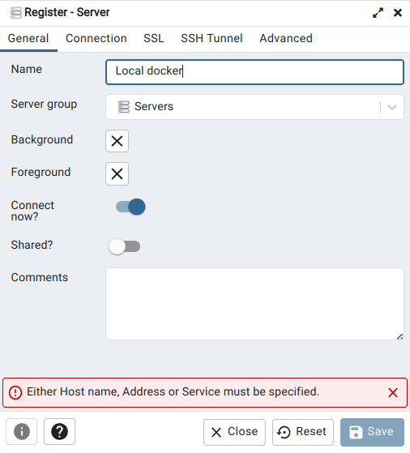

## [DE Zoomcamp 1.2.1 - Introduction to Docker](https://www.youtube.com/watch?v=EYNwNlOrpr0&list=PL3MmuxUbc_hJed7dXYoJw8DoCuVHhGEQb)

TODO

## [DE Zoomcamp 1.2.2 - Ingesting NY Taxi Data to Postgres](https://www.youtube.com/watch?v=2JM-ziJt0WI&list=PL3MmuxUbc_hJed7dXYoJw8DoCuVHhGEQb)

**Step 1:** pull the PostgreSQL docker image that we will use througout the zoomcamp.
```
docker pull postgres:13
```

**Step 2:** create and run an empty database (note that you need to change the ```-v``` local path to the desired path in your local machine).
```
docker run -it \
    -e POSTGRES_USER="root" \
    -e POSTGRES_PASSWORD="root" \
    -e POSTGRES_DB="ny_taxi" \
    -v /home/padilha/projects/de-zoomcamp/ny_taxi_postgres_data:/var/lib/postgresql/data \
    -p 5432:5432 \
    postgres:13
```

**Step 3:** we can access the empty database in another terminal as follows. If you type ```\dt```, you can see that our database is still empty.
```
pgcli -h localhost -p 5432 -u root -d ny_taxi
```

**Step 4:** download the NYC taxi dataset.
```
wget https://d37ci6vzurychx.cloudfront.net/trip-data/yellow_tripdata_2021-01.parquet
```

**Step 5:** ingest the data to Postgres using Jupyter Notebook. See [upload-data.ipynb](./upload-data.ipynb). Afterwards, we can check the ingested data using ```\dt``` in Postgres' terminal to list the tables, and ```\d yellow_taxi_data``` to describe the table ```yellow_taxi_data```.

## [DE Zoomcamp 1.2.3 - Connecting pgAdmin and Postgres](https://www.youtube.com/watch?v=hCAIVe9N0ow&list=PL3MmuxUbc_hJed7dXYoJw8DoCuVHhGEQb)


**Step 1:** basic exploration of our dataset, to check if our results matches the ones presented in the lesson.
```
SELECT count(1) from yellow_taxi_data;

SELECT max(tpep_pickup_datetime), min(tpep_pickup_datetime), max(total_amount) FROM yellow_taxi_data;
```

**Step 2:** pull pgadmin's docker image and run it.
```
docker pull dpage/pgadmin4

docker run -it \
    -e PGADMIN_DEFAULT_EMAIL="admin@admin.com" \
    -e PGADMIN_DEFAULT_PASSWORD="root" \
    -p 8080:80 \
    dpage/pgadmin4
```

**Step 3:** access pgadmin thorugh localhost:8080 in the browser. After logging in, we can create a new server (right click Servers -> Register -> Server), as follows:




Note that we are unnable to connect to server at localhost. This problem happens, because localhost refers to the pgadmin's container (remember that we are running pgadmin and Postgres in different containers). For such, we need to create a network and specify it in the docker run commands, to allow the containers to see each other.

```
docker network create pg-network

docker run -it \
    -e POSTGRES_USER="root" \
    -e POSTGRES_PASSWORD="root" \
    -e POSTGRES_DB="ny_taxi" \
    -v /home/padilha/projects/de-zoomcamp/ny_taxi_postgres_data:/var/lib/postgresql/data \
    -p 5432:5432 \
    --network=pg-network \
    --name=pg-database \
    postgres:13

docker run -it \
    -e PGADMIN_DEFAULT_EMAIL="admin@admin.com" \
    -e PGADMIN_DEFAULT_PASSWORD="root" \
    -p 8080:80 \
    --network=pg-network \
    --name=pgadmin \
    dpage/pgadmin4
```

And now, we are able to create the server using pgadmin's interface.


## [DE Zoomcamp 1.2.4 - Dockerizing the Ingestion Script](https://www.youtube.com/watch?v=B1WwATwf-vY&list=PL3MmuxUbc_hJed7dXYoJw8DoCuVHhGEQb&index=8)

**Step 1:** convert jupyter notebook upload-data.ipynb to a Python script.
```
jupyter nbconvert --to=script upload-data.ipynb
```

After cleaning the output code upload-data.py a little bit, we rename it to ingest_data.py.
```
mv upload-data.py ingest_data.py
```

**Step 2:** drop the table in pgcli.
```
DROP TABLE yellow_taxi_data;
```

**Step 3:** ingest the data using the Python script. Note that the following command is not safe for production code, since we are explicitly passing the root password of the database, which can be later accessed through the operating system command history. A better alternative would be to pass user and password as environment variables or through some type of password storage.
```
export URL="https://d37ci6vzurychx.cloudfront.net/trip-data/yellow_tripdata_2021-01.parquet"

python ingest_data.py \
    --user=root \
    --password=root \
    --host=localhost \
    --port=5432 \
    --db=ny_taxi \
    --table_name=yellow_taxi_trips \
    --url=${URL}
```

**Step 4:** Drop the table yellow_taxi_data again.
```
DROP TABLE yellow_taxi_data;
```

Then, dockerize the ingestion script (see [Dockerfile](./Dockerfile)), build and run the container.
```
docker build -t taxi_ingest:v001 .

docker run -it \
    --network=pg-network \
    taxi_ingest:v001 \
    --user=root \
    --password=root \
    --host=pg-database \
    --port=5432 \
    --db=ny_taxi \
    --table_name=yellow_taxi_trips \
    --url=${URL}
```

**Step 5:** check if the ingestion worked.
```
SELECT count(1) from yellow_taxi_trips;
```

## [DE Zoomcamp 1.2.5 - Running Postgres and pgAdmin with Docker-Compose](https://www.youtube.com/watch?v=hKI6PkPhpa0&list=PL3MmuxUbc_hJed7dXYoJw8DoCuVHhGEQb&index=9)