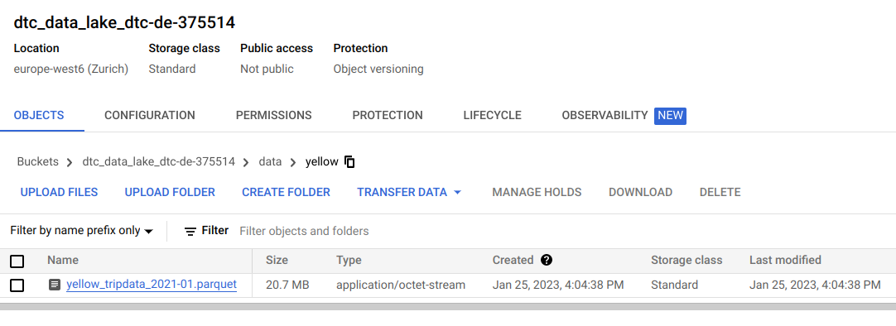

## Week 2 Overview

* [DE Zoomcamp 2.1.1 - Data Lake](#de-zoomcamp-211---data-lake)
* [DE Zoomcamp 2.2.1 - Introduction to Workflow orchestration](#de-zoomcamp-221---introduction-to-workflow-orchestration)
* [DE Zoomcamp 2.2.2 - Introduction to Prefect concepts](#de-zoomcamp-222---introduction-to-prefect-concepts)
* [DE Zoomcamp 2.2.3 - ETL with GCP & Prefect](#de-zoomcamp-223---etl-with-gcp--prefect)

## [DE Zoomcamp 2.1.1 - Data Lake](https://www.youtube.com/watch?v=W3Zm6rjOq70&list=PL3MmuxUbc_hJed7dXYoJw8DoCuVHhGEQb)

### What is a Data Lake?
A Data Lake consists of a central repository where any type of data, either structured or unstructured, can be stored. The main idea behind a Data Lake is to ingest and make data available as quickly as possible inside an organization.

### Data Lake vs. Data Warehouse
A Data Lake stores a huge amount of data and are normally used for stream processing, machine learning and real time analytics. On the other hand, a Data Warehouse stores structured data for analytics and batch processing.

### Extract-Transform-Load (ETL) vs. Extract-Load-Transform (ELT)
ETL is usually a Data Warehouse solution, used mainly for small amount of data as a schema-on-write approach. On the other hand, ELT is a Data Lake solution, employed for large amounts of data as a schema-on-read approach.

## [DE Zoomcamp 2.2.1 - Introduction to Workflow orchestration](https://www.youtube.com/watch?v=8oLs6pzHp68&list=PL3MmuxUbc_hJed7dXYoJw8DoCuVHhGEQb&index=17)

TO DO

## [DE Zoomcamp 2.2.2 - Introduction to Prefect concepts](https://www.youtube.com/watch?v=jAwRCyGLKOY&list=PL3MmuxUbc_hJed7dXYoJw8DoCuVHhGEQb&index=18)

**Step 1:** start PostgreSQL and ingest the Yellow Taxi Data (see [my notes from week1](../week1/README.md)). Note that we need to run the scripts manually. It would be much better if this script was run on a schedule, without the need to manually trigger it. By using some workflow orchestration tool, we can run scripts on a schedule and also have other advantages (resilience, automatic retries, caching, etc).

**Step 2:** transform [ingest_data.py](../week1/ingest_data.py) into a Prefect flow. For such, we move all code under ```if __name__ == '__main__``` to a function ```main_flow()```. Then, we use the ```flow``` decorator to indicate that ```main_flow()``` is a Prefect flow. According to the instructor, a flow consists of a container for workflow logic that we can use to interact and understand the state of the workflow. They receive inputs, perform a set of tasks and returns outputs. In addition, we use the ```@task``` decorator to indicate that ```ingest()``` is a task from our flow. See [ingest_data_flow.py](./ingest_data_flow.py). Then, we run this new code:
```
python ingest_data_flow.py
```

The output will be something like:

    11:29:46.512 | INFO    | Flow run 'violet-guillemot' - Created task run 'ingest-0d9f2267-0' for task 'ingest'
    11:29:46.513 | INFO    | Flow run 'violet-guillemot' - Executing 'ingest-0d9f2267-0' immediately...
    11:29:50.441 | INFO    | Task run 'ingest-0d9f2267-0' - inserted another chunk, took 3.903 seconds
    11:29:54.266 | INFO    | Task run 'ingest-0d9f2267-0' - inserted another chunk, took 3.825 seconds
    11:29:58.073 | INFO    | Task run 'ingest-0d9f2267-0' - inserted another chunk, took 3.806 seconds
    ...
    11:30:38.140 | INFO    | Task run 'ingest-0d9f2267-0' - inserted another chunk, took 2.285 seconds
    11:30:38.155 | INFO    | Task run 'ingest-0d9f2267-0' - Finished in state Completed()
    11:30:38.175 | INFO    | Flow run 'violet-guillemot' - Finished in state Completed('All states completed.')

**Step 3:** transform the script into ETL. Currently, the code performs everything all at once. We can break ```ingest()``` into three different tasks: Extract (E), Transform (T) and Load (L). See [ingest_data_flow_etl.py](./ingest_data_flow_etl.py). The output of this ETL script is something like:

    11:50:23.368 | INFO    | prefect.engine - Created flow run 'cunning-chachalaca' for flow 'Ingest Data'
    11:50:23.461 | INFO    | Flow run 'cunning-chachalaca' - Created task run 'extract-bb1266fe-0' for task 'extract'
    11:50:23.462 | INFO    | Flow run 'cunning-chachalaca' - Executing 'extract-bb1266fe-0' immediately...
    ...
    11:50:27.167 | INFO    | Task run 'extract-bb1266fe-0' - Finished in state Completed()
    11:50:27.181 | INFO    | Flow run 'cunning-chachalaca' - Created task run 'transform-a7d916b4-0' for task 'transform'
    11:50:27.181 | INFO    | Flow run 'cunning-chachalaca' - Executing 'transform-a7d916b4-0' immediately...
    11:50:27.211 | INFO    | Task run 'transform-a7d916b4-0' - pre: missing passenger count: 26726
    11:50:27.540 | INFO    | Task run 'transform-a7d916b4-0' - post: missing passenger count: 0
    11:50:27.557 | INFO    | Task run 'transform-a7d916b4-0' - Finished in state Completed()
    11:50:27.578 | INFO    | Flow run 'cunning-chachalaca' - Created task run 'load-60b30268-0' for task 'load'
    11:50:27.579 | INFO    | Flow run 'cunning-chachalaca' - Executing 'load-60b30268-0' immediately...
    11:51:17.234 | INFO    | Task run 'load-60b30268-0' - Finished in state Completed()
    11:51:17.251 | INFO    | Flow run 'cunning-chachalaca' - Finished in state Completed('All states completed.'

Note that now we have the three tasks (extract-bb1266fe-0, transform-a7d916b4-0, load-60b30268-0) instead of a single task (ingest-0d9f2267-0).

**Step 4:** run Prefect Orion UI from the terminal.
```
prefect orion start
```

Prefect Orion UI allows us to see our flows in an interactive an intuitive web interface. It summarizes the state of our workflows. Besides, we also have some extra information, such as:

* Task Run Concurrency, which can be configured by adding tags to tasks.

* Notifications, that alerts us when something goes wrong.

* Blocks, which allows us to store configurations and use them as an interface for interacting with external systems. In other words, we can securely store authentication credentials for different services, without the need to specify such credentials directly in our codes or command lines.

**Step 5:** create a new block for our PostgreSQL connector. In Prefect Orion UI, we first click in "Blocks" and then "Add Block +". Next, we add a SQLAlchemyConnector, and fill the corresponding form as follows and click on "Create".


**Step 6:** use the block in the code using this snippet (see [ingest_data_flow_etl_with_sql_block.py](./ingest_data_flow_etl_with_sql_block.py)):

```python
from prefect_sqlalchemy import SqlAlchemyConnector

with SqlAlchemyConnector.load("postgres-connector") as database_block:
    ...
```

## [DE Zoomcamp 2.2.3 - ETL with GCP & Prefect](https://www.youtube.com/watch?v=W-rMz_2GwqQ&list=PL3MmuxUbc_hJed7dXYoJw8DoCuVHhGEQb&index=19)

**Step 1:** write an ETL script for saving data locally and uploading it to GCP (see [etl_web_to_gcs.py](./etl_web_to_gcs.py)).

**Step 2:** run Prefect Orion UI from the terminal.
```
prefect orion start
```

**Step 3:** create a Prefect Block to store our GCP credentials (for generating GCP credentials, see [my notes of DE Zoomcamp 1.3.1 - Introduction to Terraform Concepts & GCP Pre-Requisites](../week1/README.md#de-zoomcamp-131---introduction-to-terraform-concepts--gcp-pre-requisites)), because blocks allow us to reuse configuration with external services, doing it in a secure way.

In the Prefect Orion UI click on "Blocks" and then find the GCS Bucket Block.


**Important note:** if GCS Bucket is not available, go to the terminal and run:
```
prefect block register -m prefect_gcp
```

**Step 4:** configure the GCS Bucket Block as follows. Note that we need to inform the GCP Bucket ID. If no bucket is available, see [my notes of DE Zoomcamp 1.3.2 - Creating GCP Infrastructure with Terraform](../week1/README.md#de-zoomcamp-132---creating-gcp-infrastructure-with-terraform). Additionally, if no GCP Credentials Block has been created yet, we need to create one by clicking on "Add +"


**Step 5:** create a GCP Credentials Block as follows. In this example, I chose to inform the path of my json file that stores my credentials. But I could also have pasted the contents directly in the blue box under "The contents of the keyfile as dict".


**Step 6:** select the GCP Credentials Block that has just been created and click on "Create".


**Step 7:** Prefect shows us how we can use the new block inside a Python script.


**Step 8:** run [etl_web_to_gcs.py](./etl_web_to_gcs.py):
```
python etl_web_to_gcs.py
```

**Step 9:** check the uploaded data in GCP interface.

