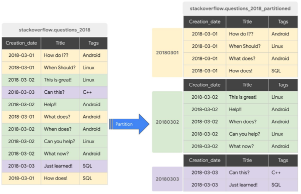

## Week 3 Overview

* [DE Zoomcamp 3.1.1 - Data Warehouse and BigQuery](#de-zoomcamp-311---data-warehouse-and-bigquery)
* [DE Zoomcamp 3.1.2 - Partioning and Clustering](#de-zoomcamp-312---partioning-and-clustering)
* [DE Zoomcamp 3.2.1 - BigQuery Best Practices](#de-zoomcamp-321---bigquery-best-practices)
* [DE Zoomcamp 3.2.2 - Internals of Big Query](#de-zoomcamp-322---internals-of-big-query)
* [DE Zoomcamp 3.3.1 - BigQuery Machine Learning](#de-zoomcamp-331---bigquery-machine-learning)
* [Learning in public (LinkedIn)](https://www.linkedin.com/posts/victor-padilha_dataengineering-datascience-dataanalytics-activity-7028696600839434240-Tmd2?utm_source=share&utm_medium=member_desktop)

## [DE Zoomcamp 3.1.1 - Data Warehouse and BigQuery](https://www.youtube.com/watch?v=jrHljAoD6nM)

**On-Line Transaction Processing (OLTP) systems** are typically used in backend services, where sequences of SQL statements are grouped together in the form of transactions, which are rolled back if any of their statements fails. These systems deal with fast and small updates, store data in normalized databases that reduce data redundancy and increase productivity of end users.

**On-Line Analytical Processing (OLAP) systems** are composed by denormalized databases, which simplify analytics queries, and are mainly used for data mining. **Data Warehouses** are the main example in this category. They generally contain data from many sources (e.g., different OLTP systems) and implement [star](https://en.wikipedia.org/wiki/Star_schema) or [snowflake](https://en.wikipedia.org/wiki/Snowflake_schema) schemas that are optimized for analytical tasks.

**BigQuery** is a Data Warehouse solution from Google. Its main advantages are: no servers to manage or software to install; high scalability and availability; and builtin features like machine learning, geospatial analysis and business inteligence directly from the SQL interface.

BigQuery provides a lot of open source data. For example, we can search for the citibike_stations public data in BigQuery.


Then, click on the table and open a new query tab.


The new tab will have the following content.
```sql
SELECT  FROM `bigquery-public-data.new_york_citibike.citibike_stations` LIMIT 1000
```

For example, we can query the `station_id` and `name` fields from the citibike_stations table.
```sql
SELECT station_id, name FROM `bigquery-public-data.new_york_citibike.citibike_stations` LIMIT 1000;
```

Now we start in the practical part of BigQuery. First, we will create an external table. According to [BigQuery's documentation](https://cloud.google.com/bigquery/docs/external-data-sources):
* _External tables are similar to standard BigQuery tables, in that these tables store their metadata and schema in BigQuery storage. However, their data resides in an external source._
* _External tables are contained inside a dataset, and you manage them in the same way that you manage a standard BigQuery table._

Here, we create an external table for our yellow taxi trips data. In my case, I included the 12 parquet files of 2021. `dtc-de-375514` is the id of my project, `trips_data_all` is the name of my dataset and `external_yellow_tripdata` is the name of the external table that we are creating.
```sql
CREATE OR REPLACE EXTERNAL TABLE `dtc-de-375514.trips_data_all.external_yellow_tripdata`
OPTIONS (
  format = 'PARQUET',
  uris = ['gs://dtc_data_lake_dtc-de-375514/data/yellow/yellow_tripdata_2021-*.parquet']
);

SELECT * FROM `dtc-de-375514.trips_data_all.external_yellow_tripdata` limit 10;
```

### Partitioning in BigQuery
 
When we create a dataset, we generally have one or more columns that are used as some type of filter. In this case, we can partition a table based on such columns to improve BigQuery's performance. In this lesson, the instructor shows us an example of a dataset containing StackOverflow questions (left), and how the dataset would look like if it was partitioned by the `Creation_date` field (right).

Partitioning is a powerful feature of BigQuery. Suppose we want to query the questions created on a specific date. Partition improves processing, because BigQuery will not read or process any data from other dates. This improves efficiency and reduces querying costs.



To illustrate the difference in performance, we first create a non partitioned data table from our dataset.
```sql
CREATE OR REPLACE TABLE `dtc-de-375514.trips_data_all.yellow_tripdata_non_partitioned` AS
SELECT * FROM `dtc-de-375514.trips_data_all.external_yellow_tripdata`;
```

For some reason, I got the following errors when running the command above.
    
    Error while reading table: dtc-de-375514.trips_data_all.external_yellow_tripdata, error message: Parquet column 'payment_type' has type DOUBLE which does not match the target cpp_type INT64. File: gs://dtc_data_lake_dtc-de-375514/data/yellow/yellow_tripdata_2021-02.parquet

    Error while reading table: dtc-de-375514.trips_data_all.external_yellow_tripdata, error message: Parquet column 'VendorID' has type DOUBLE which does not match the target cpp_type INT64. File: gs://dtc_data_lake_dtc-de-375514/data/yellow/yellow_tripdata_2021-02.parquet

Since in this example we are only interested in seeing the performance difference between a non partitioned table and a partitioned table, a quickfix for the SQL statement is:
```sql
CREATE OR REPLACE TABLE `dtc-de-375514.trips_data_all.yellow_tripdata_non_partitioned` AS
SELECT * REPLACE(
  CAST(0 AS NUMERIC) AS VendorID,
  CAST(0 AS NUMERIC) AS payment_type
) FROM `dtc-de-375514.trips_data_all.external_yellow_tripdata`;
```

Next, we create a partitioned table.
```sql
CREATE OR REPLACE TABLE `dtc-de-375514.trips_data_all.yellow_tripdata_partitioned`
PARTITION BY
  DATE(tpep_pickup_datetime) AS
SELECT * REPLACE(
  CAST(0 AS NUMERIC) AS VendorID,
  CAST(0 AS NUMERIC) AS payment_type
) FROM `dtc-de-375514.trips_data_all.external_yellow_tripdata`
```

Now, let's compare the difference in performance when querying non partitioned and partitioned data.
```sql
SELECT DISTINCT(PULocationID)
FROM `dtc-de-375514.trips_data_all.yellow_tripdata_non_partitioned`
WHERE DATE(tpep_pickup_datetime) BETWEEN '2021-01-01' AND '2021-06-30';
```


```sql
SELECT DISTINCT(PULocationID)
FROM `dtc-de-375514.trips_data_all.yellow_tripdata_partitioned`
WHERE DATE(tpep_pickup_datetime) BETWEEN '2021-06-01' AND '2021-06-30';
```


We can see the large difference in processing and billing (in this example, more than 10x improvement when using partitioned data).

Let's look into the partitions.
```sql
SELECT table_name, partition_id, total_rows
FROM trips_data_all.INFORMATION_SCHEMA.PARTITIONS
WHERE table_name = 'yellow_tripdata_partitioned'
ORDER BY total_rows DESC;
```


### Clustering in BigQuery

We can cluster tables based on some field. In the StackOverflow example presented by the instructor, after partitioning questions by date, we may want to cluster them by tag in each partition. Clustering also helps us to reduce our costs and improve query performance. The field that we choose for clustering depends on how the data will be queried.


Creating a clustered data for our dataset.

```sql
CREATE OR REPLACE TABLE `dtc-de-375514.trips_data_all.yellow_tripdata_partitioned_clustered`
PARTITION BY DATE(tpep_pickup_datetime)
CLUSTER BY PULocationID AS
SELECT * REPLACE(
  CAST(0 AS NUMERIC) AS VendorID,
  CAST(0 AS NUMERIC) AS payment_type
) FROM `dtc-de-375514.trips_data_all.external_yellow_tripdata`;
```

Now, let's compare the difference in performance when querying unclustered and clustered data.
```sql
SELECT count(*) as trips
FROM `dtc-de-375514.trips_data_all.yellow_tripdata_partitioned`
WHERE DATE(tpep_pickup_datetime) BETWEEN '2021-01-01' and '2021-10-31'
AND PULocationID = 132;
```


```sql
SELECT count(*) as trips
FROM `dtc-de-375514.trips_data_all.yellow_tripdata_partitioned_clustered`
WHERE DATE(tpep_pickup_datetime) BETWEEN '2021-01-01' and '2021-10-31'
AND PULocationID = 132;
```


We achieved ~8% of improvement in this example. As the dataset grows, this difference becomes more evident.

## [DE Zoomcamp 3.1.2 - Partioning and Clustering](https://www.youtube.com/watch?v=-CqXf7vhhDs)

**BigQuery Partitioning:** we can partition data by a time-unit column, ingestion time (_PARTITIONTIME) or an integer range partitioning. When partitioning data, to achieve its full potential, we would prefer evenly distributed partitions. In addition, we must take into account the number of partitions that we will need. BigQuery limits the number of partitions to 4000.

**BigQuery Clustering:** when clustering, a maximum of four columns can be used and the order they are specified is important to determine how the data will be sorted. Clustering improves filtering and aggregation queries and typically doesn't show much improvement for tables with less than 1 GB of data.

The instructor shows this nice comparison between Partitioning and Clustering:


**When to use Clustering over Partitioning?** It is usually better to using Clustering when: partitioning creates small partitions (e.g., each partition < 1 GB), partitionining generates more than 4000 partitions, or we need to update/modify data in the majority of partitions on a frequent basis.

## [DE Zoomcamp 3.2.1 - BigQuery Best Practices](https://www.youtube.com/watch?v=k81mLJVX08w)

**Cost reduction:**
* Avoid `SELECT *`. It is much better to specify a particular subset of columns to reduce the amount of scanned data.
* Price queries before running them.
* Use clustered or partitioned tables to optimize the number of scanned records.
* Use streaming inserts with caution, because they could drastically increase the costs.
* Materialize query results in different stages.

**Query performance:**
* Always filter data using partitioned or clustered columns.
* Use denormalized data that facilitate analytical queries.
* Excess usage of external storage might incur in more costs.
* Reduce data before performing a join operation.
* Order statements must be last part of the query to optimize performance.
* In the queries, as a best practice, place the table with the largest number of rows first, followed by the table with the fewest rows, and then place the remaining tables by decreasing sizes.

## [DE Zoomcamp 3.2.2 - Internals of Big Query](https://www.youtube.com/watch?v=eduHi1inM4s)

**Colossus:** Google's distributed file storage that stores data in a columnar format. Colossus is separated from computation. Thus, it is generally cheap.

**Jupiter:** since compute and storage are in different hardware, Google needs a very fast network for communication. Jupiter is the network that is implemented inside Google's datacenter and has ~1TB bandwidth.

**Dremel:** the query execution engine. Dremel breaks each query into a tree structure, whose parts are executed in parallel across several nodes.

**Column-oriented storage:** type of storage that is optimized for querying subsets of columns from tables. It is also efficient for performing filtering or aggregation functions over columns.

Some nice references for further reading:
* [BigQuery under the hood](https://cloud.google.com/blog/products/bigquery/bigquery-under-the-hood)
* [BigQuery explained: An overview of BigQuery's architecture](https://cloud.google.com/blog/products/data-analytics/new-blog-series-bigquery-explained-overview)
* [Dremel: Interactive Analysis of Web-Scale Datasets](http://static.googleusercontent.com/media/research.google.com/en//pubs/archive/36632.pdf)

## [DE Zoomcamp 3.3.1 - BigQuery Machine Learning](https://www.youtube.com/watch?v=B-WtpB0PuG4)

- [SQL example for ML in BigQuery](big_query_ml.sql)
- [BigQuery ML Tutorials](https://cloud.google.com/bigquery-ml/docs/tutorials)
- [BigQuery ML Reference Parameter](https://cloud.google.com/bigquery-ml/docs/analytics-reference-patterns)
- [Hyper Parameter tuning](https://cloud.google.com/bigquery-ml/docs/reference/standard-sql/bigqueryml-syntax-create-glm)
- [Feature preprocessing](https://cloud.google.com/bigquery-ml/docs/reference/standard-sql/bigqueryml-syntax-preprocess-overview)
- [BigQuery Machine Learning Deployment](https://youtu.be/BjARzEWaznU)
- [Steps to extract and deploy model with docker](https://github.com/DataTalksClub/data-engineering-zoomcamp/blob/main/week_3_data_warehouse/extract_model.md)