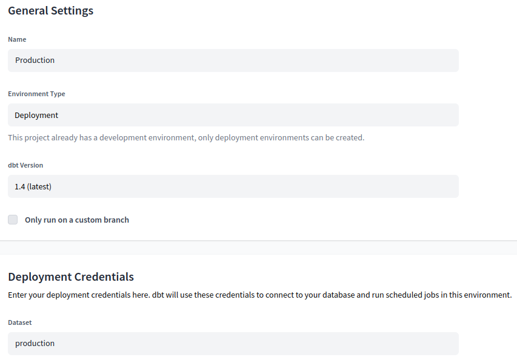

## Week 4 Overview

* [DE Zoomcamp 4.1.1 - Analytics Engineering Basics](#de-zoomcamp-411---analytics-engineering-basics)
* [DE Zoomcamp 4.1.2 - What is dbt](#de-zoomcamp-412---what-is-dbt)
* [DE Zoomcamp 4.2.1 - Start Your dbt Project: BigQuery and dbt Cloud](#de-zoomcamp-421---start-your-dbt-project-bigquery-and-dbt-cloud)
* [DE Zoomcamp 4.3.1 - Build the First dbt Models](#de-zoomcamp-431---build-the-first-dbt-models)
* [DE Zoomcamp 4.3.2 - Testing and Documenting the Project](#de-zoomcamp-432---testing-and-documenting-the-project)
* [DE Zoomcamp 4.4.1 - Deployment Using dbt Cloud](#de-zoomcamp-441---deployment-using-dbt-cloud)
* [DE Zoomcamp 4.5.1 - Visualising the data with Google Data Studio](#de-zoomcamp-451---visualising-the-data-with-google-data-studio)

## [DE Zoomcamp 4.1.1 - Analytics Engineering Basics](https://www.youtube.com/watch?v=uF76d5EmdtU&list=PL3MmuxUbc_hJed7dXYoJw8DoCuVHhGEQb&index=33)


**Kimball's Dimensional Modeling:** is an approach used for analytics, that prioritizes understandability and query performance over redundant data. The databases store denormalized data following [star](https://en.wikipedia.org/wiki/Star_schema) or [snowflake](https://en.wikipedia.org/wiki/Snowflake_schema) schemas. The elements of dimensional modeling are:

* **Fact tables**, that store measurements, metrics or facts related to the business process that occurred at some particular moment.

* **Dimensions tables**, which provide context or attributes to the fact tables. [Kleppman (2017)](https://www.google.com.br/books/edition/Designing_Data_Intensive_Applications/p1heDgAAQBAJ?hl=en&gbpv=0) arguments that dimension tables contain the who, what, where, when, how and why of the events registered in the fact tables.

## [DE Zoomcamp 4.1.2 - What is dbt](https://www.youtube.com/watch?v=4eCouvVOJUw&list=PL3MmuxUbc_hJed7dXYoJw8DoCuVHhGEQb&index=34)

Dbt is an acronym for Data Build Tool. It is a tool for the transformation of raw data into a format that allows us to perform analyses and to expose such data to the stakeholders and business managers.


## [DE Zoomcamp 4.2.1 - Start Your dbt Project: BigQuery and dbt Cloud](https://www.youtube.com/watch?v=iMxh6s_wL4Q&list=PL3MmuxUbc_hJed7dXYoJw8DoCuVHhGEQb&index=35)

**Step 1:** [set up dbt cloud with BigQuery](https://github.com/DataTalksClub/data-engineering-zoomcamp/blob/main/week_4_analytics_engineering/dbt_cloud_setup.md). Note: when initializing the cloud project, I informed week4/taxi_rides_ny as the subdirectory in the first step of the project creation.

**Step 2:** open the IDE, create a new branch, click on "Initialize dbt project" and get the result below. Note: it is important to create a new branch, because if we had chosen to work on the master branch we would get stuck in read-only mode.


## [DE Zoomcamp 4.3.1 - Build the First dbt Models](https://www.youtube.com/watch?v=UVI30Vxzd6c&list=PL3MmuxUbc_hJed7dXYoJw8DoCuVHhGEQb&index=37)

### dbt models

Dbt models are `SELECT` statements written in a SQL file. An interesting feature of dbt is that we can integrate SQL statements with the Jinja templating language. Jinja code is always written between `{{ ... }}` or `` and can be used to call macros (which are similar to functions in standard programming languages) that allow us to dynamically generate and reuse SQL statements. After compiling the dbt models, the Jinja blocks are substituted by the SQL statement generated by them.

A generic example of a dbt model is:
```sql
{{ config(materialized='table') }}
SELECT * FROM staging.source_table WHERE record_state = 'ACTIVE'
```

The `config()` macro is used to define settings related to materialization (see [this](https://docs.getdbt.com/reference/dbt-jinja-functions/config) and [this](https://docs.getdbt.com/docs/build/materializations) links for more details).

The example above would be compiled by dbt as the following SQL code:
```sql
CREATE TABLE my_schema.my_model as (
    SELECT * FROM staging.source_table WHERE record_state = 'ACTIVE'
)
```

### The FROM clause

In dbt, the `FROM` clause can refer to either sources or seeds.

**Sources** consist of data loaded to our data warehouse. The configuration of the sources is defined through yml files that are saved in the models directory. By using the `source()` macro, dbt automatically resolves the names to the right schema and solves any required dependencies. In our example, we can create the file taxi_rides_ny/models/staging/schema.yml:
```yml
version: 2

sources:
  - name: staging
    database: dtc-de-375514
    schema: trips_data_all

    tables:
      - name: green_tripdata
      - name: yellow_tripdata
```
where database refers to our BigQuery database name, schema is our dataset name, and under `tables` we list the name of our tables that exist in BigQuery. Then, for instance, we can refer to the `green_tripdata` table in our models using:
```sql
FROM {{ source('staging','green_tripdata') }}
```
For more details on sources, see [this link](https://docs.getdbt.com/docs/build/sources).

**Seeds** are csv files stored in our seed directory inside the project, which allows us to effectively version control them. Seeds are recommended for datasets that have infrequent updates.

### The FROM clause: ref macro

The `ref()` macro makes it possible for us to reference tables and views that were created from dbt models or dbt seeds. `ref()` resolves the correct schemas and any dependencies. We can use it as follows:
```sql
FROM {{ ref('stg_green_tripdata') }}
```

### Building dbt models

See [stg_green_tripdata.sql](./taxi_rides_ny/models/staging/stg_green_tripdata.sql). We can run such a model with the command below.
```
dbt run --select stg_green_tripdata
```

Note: if you have problems with location, see the course [FAQ](https://docs.google.com/document/d/19bnYs80DwuUimHM65UV3sylsCn2j1vziPOwzBwQrebw/edit#) and search for "404 Not found: Dataset was not found in location US".

In [stg_green_tripdata.sql](./taxi_rides_ny/models/staging/stg_green_tripdata.sql), we can see the following line:
```sql
{{ get_payment_type_description('payment_type') }} as payment_type_description,
```
`get_payment_type_description` consists of a macro that gives us a description of our payment type in plain English. This macro is defined as (see [get_payment_type_description.sql](./taxi_rides_ny/macros/get_payment_type_description.sql)):
```sql


    case {{ payment_type }}
        when 1 then 'Credit card'
        when 2 then 'Cash'
        when 3 then 'No charge'
        when 4 then 'Dispute'
        when 5 then 'Unknown'
        when 6 then 'Voided trip'
    end


```

Then, after we run our model, we can see the following output in target/compiled/taxi_rider_ny/staging/std_green_tripdata.sql:
```sql
select
    ...
    cast(payment_type as integer) as payment_type,
    case payment_type
        when 1 then 'Credit card'
        when 2 then 'Cash'
        when 3 then 'No charge'
        when 4 then 'Dispute'
        when 5 then 'Unknown'
        when 6 then 'Voided trip'
    end as payment_type_description, 
    cast(congestion_surcharge as numeric) as congestion_surcharge
    ...
```
Note how the macro call was substituted by its code in our SQL statement.

### Packages

Packages are standalone dbt projects that define models and macros for specific types of problems. Thus, similar to what happens in programming languages, we can reuse other packages' models and macros in our own projects.

Packages are imported using a packages.yml file in the root directory of our project. In our example, we are going to use the `dbt-labs/dbt_utils` package.
```yml
packages:
  - package: dbt-labs/dbt_utils
    version: 0.8.0
```
Next, we run `dbt deps` in our terminal, which downloads the package dependencies for our project.

For example, we can create a [surrogate key](https://docs.getdbt.com/terms/surrogate-key) for the `vendorid` and `lpep_pickup_datetime` in our model in this way (see [stg_green_tripdata.sql](./taxi_rides_ny/models/staging/stg_green_tripdata.sql)):
```sql
{{ dbt_utils.surrogate_key(['vendorid', 'lpep_pickup_datetime']) }} as tripid,
```

### Defining variables

Variables have the same concepts as in programming languages. With a macro, dbt allows us to define variables when compiling models. Variable values can be defined either on the command line or in the dbt_project.yml file.

For instance, we can define a variable `is_test_run` in [stg_green_tripdata.sql](./taxi_rides_ny/models/staging/stg_green_tripdata.sql):
```sql


  limit 100


```
Now, we can run the model and change the value of `is_test_run` using the command:
```
dbt run --select stg_green_tripdata.sql --var 'is_test_run: false'
```

### dbt seeds

Dbt seeds are meant to be used with CSV files that contain data that will not be changed often. In our example, we copy the content of [taxi_zone_lookup.csv](https://github.com/DataTalksClub/nyc-tlc-data/releases/tag/misc) and paste it in a file in the seeds directory. Then, we run `dbt seed` on the command line to create this table in our database.


Next, we create the [dim_zones.sql](./taxi_rides_ny/models/core/dim_zones.sql) model (i.e., a [dimension table](#de-zoomcamp-411---analytics-engineering-basics)):
```sql
{{ config(materialized='table') }}

select 
    locationid, 
    borough, 
    zone, 
    replace(service_zone,'Boro','Green') as service_zone
from {{ ref('taxi_zone_lookup') }}
```

See how we used `ref()` to refer our table created by a dbt seed.

### Unioning our models in fact_trips and understanding dependencies

Finally, we write our fact table described by the model [fact_trips.sql](./taxi_rides_ny/models/core/fact_trips.sql) and we can visualize the data lineage.


To build all models and seeds we run `dbt build`.

## [DE Zoomcamp 4.3.2 - Testing and Documenting the Project](https://www.youtube.com/watch?v=UishFmq1hLM&list=PL3MmuxUbc_hJed7dXYoJw8DoCuVHhGEQb&index=36)

### Tests

Tests are assumptions (e.g., a behavior) that we make about our data. In dbt, we write tests as `SELECT` queries, which get compiled as SQL queries that return to us the number of failing records. In other words, a test returns to us the number of records that violate the assumptions that we made. Tests are defined in the project yml file.

We can write custom tests, use basic tests that are available by dbt or tests provided by dbt packages.

We can see how tests are defined on [staging/schema.yml](./taxi_rides_ny/models/staging/schema.yml). For example, if we want to test the tripid column for uniqueness and not null values:
```yml
columns:
  - name: tripid
    description: Primary key for this table, generated with a concatenation of vendorid+pickup_datetime
    tests:
        - unique:
            severity: warn
        - not_null:
            severity: warn
```

Where the severity can be either `warn` or `error`. In the former case, dbt will warn us about any failures and keep running. In the latter, dbt will raise an error and stop the execution.

We can run all tests through the command `dbt test` or we can select a particular model through `dbt test --select <model_name>`.

### Documentation

It is possible to generate documentation that gets rendered as a website and can be hosted in dbt cloud. The documentation includes information about our project (models, dependencies, sources, etc) and about our data warehouse (column names, data types, etc).

## [DE Zoomcamp 4.4.1 - Deployment Using dbt Cloud](https://www.youtube.com/watch?v=rjf6yZNGX8I&list=PL3MmuxUbc_hJed7dXYoJw8DoCuVHhGEQb&index=37)

Deployment consists of running in a production environment the models we created in our development environment. By separating the development and deployment environments, we can create and deliver models continually without affecting the models that are already in production.

**Continuous Integration (CI)** is the practice of regularly merging development branches into a central repository. Ideally, these merging processes also include automated builds and tests. Dbt can be easily integrated with GitHub or GitLab, to receive webhooks when a pull request is ready to be merged. Then, the webhook that is received will enqueue a new run of the specified job. No pull request is able to be merged unless the run finishes successfully.

**Step 1:** create a production environment on Deploy -> Environments.



**Step 2:** create a job on Deploy -> Jobs


**Step 3:** run the job and get an output like this:


We can also take a look at our artifacts and access our docs (by clicking on "View documentation").


## [DE Zoomcamp 4.5.1 - Visualising the data with Google Data Studio](https://www.youtube.com/watch?v=39nLTs74A3E&list=PL3MmuxUbc_hJed7dXYoJw8DoCuVHhGEQb&index=43)

**Step 1:** open [Google Data Studio](https://lookerstudio.google.com/).

**Step 2:** create a BigQuery data source (it may be necessary to authorize Google Data Studio to access BigQuery), select our production table and click on connect.


**Step 3:** in the next screen, we can see that the tool already suggests some aggregations for us. In this example, we set all of them to None, except for `passenger_count`, for which we keep the "Sum" aggregation.

**Step 4:** let's start by creating a simple time series chart including `service_type` as the breakdown dimension.


**Step 5:** it is possible to observe some outliers among the dates (note that the date range goes up to the year 2078). So, let's add a date range control and set the date interval between Jan 1st, 2019 and Dec, 31st 2020.


**Step 6:** create some additional charts...

