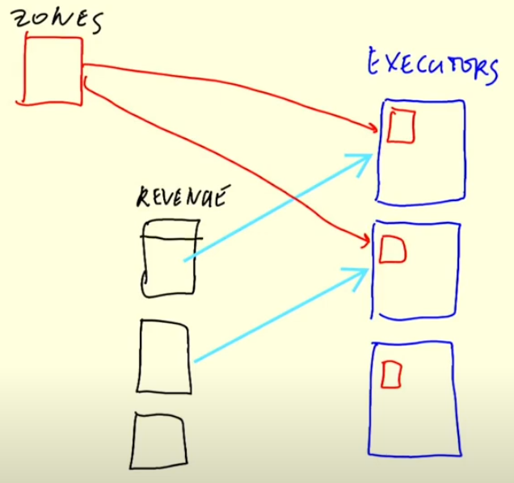

## Week 5 Overview

* [DE Zoomcamp 5.1.1 - Introduction to Batch processing](#de-zoomcamp-511---introduction-to-batch-processing)
* [DE Zoomcamp 5.1.2 - Introduction to Spark](#de-zoomcamp-512---introduction-to-spark)
* [DE Zoomcamp 5.3.1 - First Look at Spark/PySpark](#de-zoomcamp-531---first-look-at-sparkpyspark)
* [DE Zoomcamp 5.3.2 - Spark DataFrames](#de-zoomcamp-532---spark-dataframes)
* [DE Zoomcamp 5.3.3 - (Optional) Preparing Yellow and Green Taxi Data](./05_taxi_schema.ipynb)
* [DE Zoomcamp 5.3.4 - SQL with Spark](./06_spark_sql.ipynb)
* [DE Zoomcamp 5.4.2 - GroupBy in Spark](#de-zoomcamp-542---groupby-in-spark)
* [DE Zoomcamp 5.4.3 - Joins in Spark](#de-zoomcamp-543---joins-in-spark)
* [DE Zoomcamp 5.5.1 - (Optional) Operations on Spark RDDs](#de-zoomcamp-551---optional-operations-on-spark-rdds)
* [DE Zoomcamp 5.5.2 - (Optional) Spark RDD mapPartition](#de-zoomcamp-552---optional-spark-rdd-mappartition)
* [DE Zoomcamp 5.6.1 - Connecting to Google Cloud Storage](#de-zoomcamp-561---connecting-to-google-cloud-storage)
* [DE Zoomcamp 5.6.2 - Creating a Local Spark Cluster](#de-zoomcamp-562---creating-a-local-spark-cluster)
* [DE Zoomcamp 5.6.3 - Setting up a Dataproc Cluster](#de-zoomcamp-563---setting-up-a-dataproc-cluster)
* [DE Zoomcamp 5.6.4 - Connecting Spark to Big Query](#de-zoomcamp-564---connecting-spark-to-big-query)

## [DE Zoomcamp 5.1.1 - Introduction to Batch processing](https://www.youtube.com/watch?v=dcHe5Fl3MF8&list=PL3MmuxUbc_hJed7dXYoJw8DoCuVHhGEQb)

Batch jobs are routines that are run in regular intervals. The most common types of batch jobs are either daily or hourly jobs. Batch jobs process data after the reference time period is over (e.g., after a day ends, a batch job processes all data that was gathered in that day). Batch jobs are easy to manage, retry (which also helps for fault tolerance) and scale. The main disadvantage is that we won't have the most recent data available, since we need to wait for an interval to end and our batch workflows run before being able to do anything with such data.

## [DE Zoomcamp 5.1.2 - Introduction to Spark](https://www.youtube.com/watch?v=FhaqbEOuQ8U&list=PL3MmuxUbc_hJed7dXYoJw8DoCuVHhGEQb)

Apache Spark is a data processing engine (i.e., the processing happens _in_ Spark) that is normally used for batch processing (although it can also be used for streaming).

Spark typically pulls data from a data lake, performs some processing steps and stores the data back in the data lake. Spark can be used for tasks where we would use SQL. However, the engine is recommended for dealing directly with files and in situations where we need more flexibility than SQL offers, such as: if we want to split our code into different modules, write unit tests or even some functionality that may not be possible to write using SQL (e.g., machine learning-related routines, such as training and/or using a model).

In the lesson, Alexey Grigorev gives us the following advice: _"If you can express something with SQL, you should go with SQL. But for cases where you cannot you should go with Spark"_.

## [DE Zoomcamp 5.3.1 - First Look at Spark/PySpark](https://www.youtube.com/watch?v=r_Sf6fCB40c&list=PL3MmuxUbc_hJed7dXYoJw8DoCuVHhGEQb)

To be able to use PySpark, I created a conda environment and installed it using the following commands:
```
conda install openjdk
conda install pyspark
```

**Step 1:** `SparkSession` is the entry point into all functionality in Spark. We usually create a `SparkSession` as in the following example:
```python
from pyspark.sql import SparkSession
spark = SparkSession.builder \
    .master("local[*]") \
    .appName('test') \
    .getOrCreate()
```

We can analyze the code above in smaller parts:
* `builder` is a class attribute that is and instance of `pyspark.sql.session.SparkSession.Builder` that is used to construct `SparkSession` instances.
* `master("local[*]")` sets the Spark master URL to connect to. In this example, `local` refers to the local machine and `[*]` tells Spark to use all available cores (e.g., if we wanted to use only 2 cores, we would write `local[2]`).
* `appName('test')` sets the application name that is shown in Spark UI.
* `getOrCreate()` returns an existing `SparkSession`, if available, or creates a new one.

**Step 2:** read the fhvhv_tripdata_2021-01.csv.gz (available [here](https://github.com/DataTalksClub/nyc-tlc-data/releases/tag/fhvhv)).
```python
df = spark.read \
    .option("header", "true") \
    .option("inferSchema",True) \
    .csv('fhvhv_tripdata_2021-01.csv.gz')
df.show(5)
```

**Step 3:** check the inferred schema through `df.schema`. For the fhvhv tripdata, we get the following output:
```
StructType(
    List(
        StructField(hvfhs_license_num,StringType,true),
        StructField(dispatching_base_num,StringType,true),
        StructField(pickup_datetime,StringType,true),
        StructField(dropoff_datetime,StringType,true),
        StructField(PULocationID,IntegerType,true),
        StructField(DOLocationID,IntegerType,true),
        StructField(SR_Flag,IntegerType,true)
    )
)
```

It is possible to observe that `pickup_datetime` and `dropoff_datetime` were both interpreted as strings. Furthermore, if we haven't used `inferSchema`, Spark would interpret `PULocationID` and `DOLocationID` as LongTypes (which use 8 bytes instead of the 4 bytes used by IntegerType). When these things happen, we may want to achieve better performance and intepret all fields correctly. Then, we can specify the expected schema:
```python
from pyspark.sql import types
schema = types.StructType(
    [
        types.StructField('hvfhs_license_num', types.StringType(), True),
        types.StructField('dispatching_base_num', types.StringType(), True),
        types.StructField('pickup_datetime', types.TimestampType(), True),
        types.StructField('dropoff_datetime', types.TimestampType(), True),
        types.StructField('PULocationID', types.IntegerType(), True),
        types.StructField('DOLocationID', types.IntegerType(), True),
        types.StructField('SR_Flag', types.IntegerType(), True)
    ]
)

df = spark.read \
    .option("header", "true") \
    .option("inferSchema",True) \
    .csv('fhvhv_tripdata_2021-01.csv.gz')

df.schema
```

**Step 4:** save DataFrame as parquet. As explained by the instructor, it is not good to have a smaller number of files than CPUs (because only a subset of CPUs will be used and the remaining will be idle). For such, we first use the repartition method and then save the data as parquet. Suppose we have 8 cores, then we can repartition our dataset into 24 parts.
```
df = df.repartition(24)
df.write.parquet('fhvhv/2021/01/')
```

Then, if we list the output directory, we should get an output similar to this one:

    part-00000-d7d0e901-04fe-46b9-95a6-aea2a107e8e1-c000.snappy.parquet
    part-00001-d7d0e901-04fe-46b9-95a6-aea2a107e8e1-c000.snappy.parquet
    part-00002-d7d0e901-04fe-46b9-95a6-aea2a107e8e1-c000.snappy.parquet
    part-00003-d7d0e901-04fe-46b9-95a6-aea2a107e8e1-c000.snappy.parquet
    part-00004-d7d0e901-04fe-46b9-95a6-aea2a107e8e1-c000.snappy.parquet
    part-00005-d7d0e901-04fe-46b9-95a6-aea2a107e8e1-c000.snappy.parquet
    part-00006-d7d0e901-04fe-46b9-95a6-aea2a107e8e1-c000.snappy.parquet
    part-00007-d7d0e901-04fe-46b9-95a6-aea2a107e8e1-c000.snappy.parquet
    part-00008-d7d0e901-04fe-46b9-95a6-aea2a107e8e1-c000.snappy.parquet
    part-00009-d7d0e901-04fe-46b9-95a6-aea2a107e8e1-c000.snappy.parquet
    part-00010-d7d0e901-04fe-46b9-95a6-aea2a107e8e1-c000.snappy.parquet
    part-00011-d7d0e901-04fe-46b9-95a6-aea2a107e8e1-c000.snappy.parquet
    part-00012-d7d0e901-04fe-46b9-95a6-aea2a107e8e1-c000.snappy.parquet
    part-00013-d7d0e901-04fe-46b9-95a6-aea2a107e8e1-c000.snappy.parquet
    part-00014-d7d0e901-04fe-46b9-95a6-aea2a107e8e1-c000.snappy.parquet
    part-00015-d7d0e901-04fe-46b9-95a6-aea2a107e8e1-c000.snappy.parquet
    part-00016-d7d0e901-04fe-46b9-95a6-aea2a107e8e1-c000.snappy.parquet
    part-00017-d7d0e901-04fe-46b9-95a6-aea2a107e8e1-c000.snappy.parquet
    part-00018-d7d0e901-04fe-46b9-95a6-aea2a107e8e1-c000.snappy.parquet
    part-00019-d7d0e901-04fe-46b9-95a6-aea2a107e8e1-c000.snappy.parquet
    part-00020-d7d0e901-04fe-46b9-95a6-aea2a107e8e1-c000.snappy.parquet
    part-00021-d7d0e901-04fe-46b9-95a6-aea2a107e8e1-c000.snappy.parquet
    part-00022-d7d0e901-04fe-46b9-95a6-aea2a107e8e1-c000.snappy.parquet
    part-00023-d7d0e901-04fe-46b9-95a6-aea2a107e8e1-c000.snappy.parquet
    _SUCCESS

## [DE Zoomcamp 5.3.2 - Spark DataFrames](https://www.youtube.com/watch?v=ti3aC1m3rE8&list=PL3MmuxUbc_hJed7dXYoJw8DoCuVHhGEQb)

We start by reading the parquet data that we saved in the end of the last lesson.
```python
df = spark.read.parquet('fhvhv/2021/01/')
```

We can print the schema, which is also contained in the files and is interpreted by Spark, using `df.printSchema()` and get the output below.

    root
    |-- hvfhs_license_num: string (nullable = true)
    |-- dispatching_base_num: string (nullable = true)
    |-- pickup_datetime: timestamp (nullable = true)
    |-- dropoff_datetime: timestamp (nullable = true)
    |-- PULocationID: integer (nullable = true)
    |-- DOLocationID: integer (nullable = true)
    |-- SR_Flag: integer (nullable = true)

Next, we can use the `select()` and `filter()` methods to execute simple queries on our DataFrame.
```python
df.select('pickup_datetime', 'dropoff_datetime', 'PULocationID', 'DOLocationID') \
    .filter(df.hvfhs_license_num == 'HV0003')
```
In the code above we selected 4 columns where `hvfhs_license_num` is equal to 'HV0003'.

### Actions vs. Transformations

In Spark, we have a distinction between Actions (code that is executed immediately) and Transformations (code that is lazy, i.e., not executed immediately).

Examples of Transformations are: selecting columns, data filtering, joins and groupby operations. In these cases, Spark creates a sequence of transformations that is executed only when we call some method like `show()`, which is an example of an Action.

Examples of Actions are: `show()`, `take()`, `head()`, `write()`, etc.

### Spark SQL Functions

Spark has many predefined SQL-like functions.
```python
from pyspark.sql import functions as F
df \
    .withColumn('pickup_date', F.to_date(df.pickup_datetime)) \
    .withColumn('dropoff_date', F.to_date(df.dropoff_datetime)) \
    .select('pickup_date', 'dropoff_date', 'PULocationID', 'DOLocationID') \
    .show()
```

In addition, we can also define custom functions to run on our DataFrames.
```python
def crazy_stuff(base_num):
    num = int(base_num[1:])
    if num % 7 == 0:
        return f's/{num:03x}'
    elif num % 3 == 0:
        return f'a/{num:03x}'
    return f'e/{num:03x}'

crazy_stuff_udf = F.udf(crazy_stuff, returnType=types.StringType())

df \
    .withColumn('pickup_date', F.to_date(df.pickup_datetime)) \
    .withColumn('dropoff_date', F.to_date(df.dropoff_datetime)) \
    .withColumn('base_id', crazy_stuff_udf(df.dispatching_base_num)) \
    .select('base_id', 'pickup_date', 'dropoff_date', 'PULocationID', 'DOLocationID') \
    .show()
```

## [DE Zoomcamp 5.4.2 - GroupBy in Spark](https://www.youtube.com/watch?v=9qrDsY_2COo&list=PL3MmuxUbc_hJed7dXYoJw8DoCuVHhGEQb)

In Spark, GroupBy works in two different stages, which were illustrated by Alexey Grigorev in the figures below. See [07_groupby_join.ipynb](./07_groupby_join.ipynb) for this lesson's code.

First, let's suppose we have three partitions, two executers and that each executer executes the following code:
```python
df_green_revenue = spark.sql("""
SELECT
    -- Reveneue grouping
    PULocationID AS revenue_zone,
    date_trunc('hour', lpep_pickup_datetime) AS hour_month,

    SUM(total_amount) AS revenue_monthly_total_amount,
    count(1) AS number_records
FROM
    green
WHERE
    lpep_pickup_datetime >= '2020-01-01 00:00:00'
GROUP BY
    1, 2
ORDER BY
    1, 2
""")
```

Each executer first goes through a filtering step (```lpep_pickup_datetime >= '2020-01-01 00:00:00'```) and then performs an initial groupby operation, since each executer can process only a single partition at a time. After that, the results for each partition are contained in temporary files (in the figure it is called as "subresults", but the instructor also suggested "intermediate results" as a better name).


[*Drawing by Alexey Grigorev*](https://youtu.be/9qrDsY_2COo?list=PL3MmuxUbc_hJed7dXYoJw8DoCuVHhGEQb&t=407)

Second, Spark takes the intermediate results and performs reshuffling, which moves records between partitions in order to group records with the same key in the same partition (note in the figure the case for records grouped by (H1, Z1) and (H1, Z2)). These steps are performed by an algorithm called External Merge Sort. After reshuffling, Spark does another groupby to group all records with the same key and then reduce the groups to single records.


[*Drawing by Alexey Grigorev*](https://youtu.be/9qrDsY_2COo?list=PL3MmuxUbc_hJed7dXYoJw8DoCuVHhGEQb&t=582)

## [DE Zoomcamp 5.4.3 - Joins in Spark](https://www.youtube.com/watch?v=lu7TrqAWuH4&list=PL3MmuxUbc_hJed7dXYoJw8DoCuVHhGEQb)

In this lesson, we are going to join the yellow and green taxi tables (see [07_groupby_join.ipynb](./07_groupby_join.ipynb)). Both tables are groupped by hour and zone. Now, we want to join them into one table, as in the drawing below, where the yellow columns are the ones that we are going to join on (hour and zone), producing a wider table.


[*Drawing by Alexey Grigorev*](https://youtu.be/lu7TrqAWuH4?list=PL3MmuxUbc_hJed7dXYoJw8DoCuVHhGEQb&t=82)

See [07_groupby_join.ipynb](./07_groupby_join.ipynb) for the full code. The operation that we are interested in is:
```python
df_join = df_green_revenue_tmp.join(df_yellow_revenue_tmp, on=['hour', 'zone'], how='outer')
```

**How does the above join is performed by Spark?** See the drawing below by Alexey Grigorev. Suppose that we have two partitions per dataset (i.e., two partitions for yellow and two parittions for green), where $\{ Y_1, Y_2, Y_3, ... \}$ and $\{ G_1, G_2, G_3, ... \}$ are the records of each dataset and each record is composed by multiple columns: hour, zone, revenue and count of trips, $(H, Z, R, C)$.

The records will be joined by a composite key (hour, zone), illustrated as $\{ K_1, K_2, ... \}$. In the next step, Spark does reshuffling with External Merge Sort. Suppose that we have three output partitions, then every record with $K_1$ will go to the first partition, $K_2$ will go to the second, $K_3$ to the third and $K_4$ would go to the first partition. As a reminder, the reshuffling step is performed to ensure that records with the same keys end up in the same partitions.


[*Drawing by Alexey Grigorev*](https://youtu.be/lu7TrqAWuH4?list=PL3MmuxUbc_hJed7dXYoJw8DoCuVHhGEQb&t=456)

Lastly, Spark performs a reduce step similar to the one in groupby, where multiple records are reduced into one. See the drawing below, which illustrates an outer join.


[*Drawing by Alexey Grigorev*](https://youtu.be/lu7TrqAWuH4?list=PL3MmuxUbc_hJed7dXYoJw8DoCuVHhGEQb&t=485)

In the end of the lesson, we also perform a join between the yellow-green joined table and the taxi zones lookup table. In this case, taxi zones lookup consists of a small table and, for such a reason, Spark performs the join a little bit differently. In this join, Spark broadcasts the zones table to all executors, and the join happens in memory, without the need for any shuffling and merge sort join.



[*Drawing by Alexey Grigorev*](https://youtu.be/lu7TrqAWuH4?list=PL3MmuxUbc_hJed7dXYoJw8DoCuVHhGEQb&t=924)

## [DE Zoomcamp 5.5.1 - (Optional) Operations on Spark RDDs](https://www.youtube.com/watch?v=Bdu-xIrF3OM&list=PL3MmuxUbc_hJed7dXYoJw8DoCuVHhGEQb)

This lesson is related to Resilient Distributed Datasets (RDDs). According to the instructor, most of data processing can be done using Spark DataFrames. Therefore, this class is optional, since it just shows how some things used to be done in Spark a few years ago and how some things are implemented internally. The full code is available in [08_rdds.ipynb](./08_rdds.ipynb).

**Resilient Distributed Dataset (RDD):** a RDD is a distributed dataset that is partitioned. Spark DataFrames are implemented on top of RDDs. Their main difference is that DataFrames have a schema while RDDs are only a distributed collection of objects.

As an example, let's implement the following query using RDDs:
```sql
SELECT 
    date_trunc('hour', lpep_pickup_datetime) AS hour, 
    PULocationID AS zone,

    SUM(total_amount) AS amount,
    COUNT(1) AS number_records
FROM
    green
WHERE
    lpep_pickup_datetime >= '2020-01-01 00:00:00'
GROUP BY
    1, 2
```

**Step 1:** start by loading the green dataset and taking the first five records of the RDD after selecting the desired subset of columns:
```python
df_green = spark.read.parquet('data/pq/green/*/*')

rdd = df_green \
    .select('lpep_pickup_datetime', 'PULocationID', 'total_amount') \
    .rdd

rdd.take(5)
```

Which gives us an output like:
```
[Row(lpep_pickup_datetime=datetime.datetime(2020, 1, 8, 15, 1, 13), PULocationID=97, total_amount=13.5),
 Row(lpep_pickup_datetime=datetime.datetime(2020, 1, 27, 16, 4), PULocationID=231, total_amount=29.21),
 Row(lpep_pickup_datetime=datetime.datetime(2020, 1, 11, 11, 3), PULocationID=222, total_amount=18.48),
 Row(lpep_pickup_datetime=datetime.datetime(2020, 1, 26, 12, 13), PULocationID=174, total_amount=16.93),
 Row(lpep_pickup_datetime=datetime.datetime(2020, 1, 22, 3, 48, 21), PULocationID=260, total_amount=6.8)]
```

In Spark, `Row` is an special object used to build DataFrames.

**Step 2:** we use the `filter` method to filter by `lpep_pickup_datetime` (i.e., to implement the `WHERE` clause):
```python
from datetime import datetime

def filter_outliers(row):
    return row.lpep_pickup_datetime >= start

start = datetime(year=2020, month=1, day=1)
rdd.filter(filter_outliers).take(3)
```

**Step 3:** apply the `map` function to implement `SUM(total_amount) AS amount` and `COUNT(1) AS number_records`. In order to be able to groupby, the output of the `map` function must be something in the format (key, value), where key is a composite key (hour zone) and value will (amount, count):
```python
def prepare_for_grouping(row):
    hour = row.lpep_pickup_datetime.replace(minute=0, second=0, microsecond=0)
    zone = row.PULocationID
    key = (hour, zone)
    
    amount = row.total_amount
    count = 1
    value = (amount, count)
    
    return (key, value)

rdd \
    .filter(filter_outliers) \
    .map(prepare_for_grouping) \
    .take(5)
```

**Step 4:** combine values with the same key into a single record. In other words, perform a reduce operation:
```python
def calculate_revenue(left_value, right_value):
    left_amount, left_count = left_value    
    right_amount, right_count = right_value
    
    output_amount = left_amount + right_amount
    output_count = left_count + right_count
    return (output_amount, output_count)

rdd \
    .filter(filter_outliers) \
    .map(prepare_for_grouping) \
    .reduceByKey(calculate_revenue) \
    .take(5)
```

Which produces an output similar to:
```
[((datetime.datetime(2020, 1, 9, 9, 0), 7), (458.36000000000007, 30)),
 ((datetime.datetime(2020, 1, 3, 17, 0), 165), (69.14, 2)),
 ((datetime.datetime(2020, 1, 18, 21, 0), 42), (203.26999999999998, 15)),
 ((datetime.datetime(2020, 1, 3, 17, 0), 241), (22.3, 2)),
 ((datetime.datetime(2020, 1, 1, 7, 0), 80), (1653.3099999999997, 39))]
```

**Step 5:** we can see that the output of Step 4 is a structure of nested tuples, which is not so easy to manipulate. Therefore, we unwrap this structure with another `map` function:
```python
def unwrap(row):
    return (row[0][0], row[0][1], row[1][0], row[1][1])

rdd \
    .filter(filter_outliers) \
    .map(prepare_for_grouping) \
    .reduceByKey(calculate_revenue) \
    .map(unwrap) \
    .toDF() \
    .show()
```

The output is a dataframe like this one:
```
+-------------------+---+------------------+---+
|                 _1| _2|                _3| _4|
+-------------------+---+------------------+---+
|2020-01-09 09:00:00|  7|458.36000000000007| 30|
|2020-01-03 17:00:00|165|             69.14|  2|
|2020-01-18 21:00:00| 42|203.26999999999998| 15|
|2020-01-03 17:00:00|241|              22.3|  2|
|2020-01-01 07:00:00| 80|1653.3099999999997| 39|
|2020-01-30 23:00:00|129|            292.88| 25|
|2020-01-13 14:00:00| 25|             441.0| 22|
|2020-01-10 11:00:00| 97| 389.8400000000001| 20|
|2020-01-07 08:00:00|133|163.23000000000002|  7|
|2020-01-22 13:00:00|244| 589.1100000000001| 28|
|2020-01-22 20:00:00|181| 257.4300000000001| 21|
|2020-01-30 18:00:00| 66| 515.8800000000001| 22|
|2020-01-22 13:00:00|130|361.46000000000004| 14|
|2020-01-09 14:00:00|193|             143.4| 11|
|2020-01-07 16:00:00|129|191.92999999999998| 14|
|2020-01-19 02:00:00|255|            469.14| 22|
|2020-01-06 07:00:00|244|            297.64| 13|
|2020-01-25 15:00:00| 95|486.52000000000015| 30|
|2020-01-08 20:00:00|212|             52.75|  3|
|2020-01-04 01:00:00| 41|284.76000000000005| 29|
+-------------------+---+------------------+---+
only showing top 20 rows
```

Note that column names are lost. We can circumvent this problem using a namedtuple as follows:
```python
from collections import namedtuple

RevenueRow = namedtuple('RevenueRow', ['hour', 'zone', 'revenue', 'count'])

def unwrap(row):
    return RevenueRow(
        hour=row[0][0],
        zone=row[0][1],
        revenue=row[1][0],
        count=row[1][1]
    )

rdd \
    .filter(filter_outliers) \
    .map(prepare_for_grouping) \
    .reduceByKey(calculate_revenue) \
    .map(unwrap) \
    .toDF() \
    .show()
```

Now, the output DataFrame will have column names:
```
+-------------------+----+------------------+-----+
|               hour|zone|           revenue|count|
+-------------------+----+------------------+-----+
|2020-01-09 09:00:00|   7|458.36000000000007|   30|
|2020-01-03 17:00:00| 165|             69.14|    2|
|2020-01-18 21:00:00|  42|203.26999999999998|   15|
|2020-01-03 17:00:00| 241|              22.3|    2|
|2020-01-01 07:00:00|  80|1653.3099999999997|   39|
|2020-01-30 23:00:00| 129|            292.88|   25|
|2020-01-13 14:00:00|  25|             441.0|   22|
|2020-01-10 11:00:00|  97| 389.8400000000001|   20|
|2020-01-07 08:00:00| 133|163.23000000000002|    7|
|2020-01-22 13:00:00| 244| 589.1100000000001|   28|
|2020-01-22 20:00:00| 181| 257.4300000000001|   21|
|2020-01-30 18:00:00|  66| 515.8800000000001|   22|
|2020-01-22 13:00:00| 130|361.46000000000004|   14|
|2020-01-09 14:00:00| 193|             143.4|   11|
|2020-01-07 16:00:00| 129|191.92999999999998|   14|
|2020-01-19 02:00:00| 255|            469.14|   22|
|2020-01-06 07:00:00| 244|            297.64|   13|
|2020-01-25 15:00:00|  95|486.52000000000015|   30|
|2020-01-08 20:00:00| 212|             52.75|    3|
|2020-01-04 01:00:00|  41|284.76000000000005|   29|
+-------------------+----+------------------+-----+
only showing top 20 rows
```

## [DE Zoomcamp 5.5.2 - (Optional) Spark RDD mapPartition](https://www.youtube.com/watch?v=k3uB2K99roI&list=PL3MmuxUbc_hJed7dXYoJw8DoCuVHhGEQb&index=53)

`mapPartition` receives a data partition as input, applies some function to this data, and produces another partition as output. This process is illustrated in the drawing below. Suppose we have a 1 TB dataset that is partitioned into chunks of 100 MB. We want to process each chunk and produce another partition with processed data. Many applications benefit from this sequence of steps, such as machine learning. Suppose we have a trained machine learning model that we put inside the `mapPartition` function. Then, Spark will chunk a large dataset into smaller partitions and apply our model to each partition, outputting its predictions.


[*Drawing by Alexey Grigorev*](https://youtu.be/k3uB2K99roI?list=PL3MmuxUbc_hJed7dXYoJw8DoCuVHhGEQb&t=109)

As a first example, we implement a simple method to count the number of rows in each partition, to illustrate how to use `mapPartition`:
```python
def count_rows(partition):
    count = 0
    for row in partition:
        count += 1
    return [count]

columns = ['VendorID', 'lpep_pickup_datetime', 'PULocationID', 'DOLocationID', 'trip_distance']

duration_rdd = df_green \
    .select(columns) \
    .rdd

duration_rdd.mapPartitions(count_rows).collect()
```

We can also reimplement `count_rows` using pandas (note that although a pandas.DataFrame is simpler to manipulate, this approach materializes the entire DataFrame in memory):
```python
import pandas as pd

def count_rows_using_pandas(partition):
    df = pd.DataFrame(partition, columns=columns)
    return [len(df)]

duration_rdd.mapPartitions(count_rows_using_pandas).collect()
```

Now, let's suppose we have a simple machine learning model that predicts the trip duration as the trip distance multiplied by 5. Our code can be implemented as follows:
```python
def model_predict(df):
    #y_pred = model.predict(df)
    y_pred = df.trip_distance * 5
    return y_pred

def apply_model_in_batch(rows):
    df = pd.DataFrame(rows, columns=columns)
    predictions = model_predict(df)
    df['predicted_duration'] = predictions
    for row in df.itertuples():
        yield row

df_predictions = duration_rdd \
    .mapPartitions(apply_model_in_batch) \
    .toDF() \
    .drop('Index')

df_predictions.select('predicted_duration').show()
```

As discussed by the instructor, this type of application would use real time processing rather than batch processing, since we would like to inform the estimated time that the trip will take to the user as soon as he/she requests a taxi in his/her app. However, this lesson just pretended it would use batch processing to explain how we can implement `mapPartition` using PySpark.

## [DE Zoomcamp 5.6.1 - Connecting to Google Cloud Storage](https://www.youtube.com/watch?v=Yyz293hBVcQ&list=PL3MmuxUbc_hJed7dXYoJw8DoCuVHhGEQb&index=55)

**Step 1:** let's upload `data/pq` to GCS.
```
cd data/
gsutil -m cp -r pq/ gs://dtc_data_lake_dtc-de-375514/pq
```

If you had the following error: *ServiceException: 401 Anonymous caller does not have storage.objects.list access to the Google Cloud Storage bucket. Permission 'storage.objects.list' denied on resource (or it may not exist).*, you must first authenticate in your terminal through the command `gcloud auth login` and then try again.

**Step 2:** download the `gcs-connector-hadoop3-latest.jar`.
```
wget https://storage.googleapis.com/hadoop-lib/gcs/gcs-connector-hadoop3-latest.jar
```

**Step 3:** configure and connect to GCS. Check the first 6 cells of [09_spark_gcs.ipynb](./09_spark_gcs.ipynb).

## [DE Zoomcamp 5.6.2 - Creating a Local Spark Cluster](https://www.youtube.com/watch?v=HXBwSlXo5IA&list=PL3MmuxUbc_hJed7dXYoJw8DoCuVHhGEQb&index=55)

**Step 1:** start Spark cluster. For this week, I installed everything related to Spark and PySpark using conda. However, to be able to create a local Spark cluster as explained in the video, I needed to download Spark directly from the website.
```
wget https://archive.apache.org/dist/spark/spark-3.2.1/spark-3.2.1-bin-hadoop3.2.tgz
tar -xzf spark-3.2.1-bin-hadoop3.2.tgz
export SPARK_HOME="$(pwd)/spark-3.2.1-bin-hadoop3.2"
export PATH="${SPARK_HOME}/bin:${PATH}"
./spark-3.2.1-bin-hadoop3.2/sbin/start-master.sh
```

To check the address of the master, we can cat the logging file generated by spark. In my case, the file was located in `./spark-3.2.1-bin-hadoop3.2/logs/spark-padilha-org.apache.spark.deploy.worker.Worker-1-padilha-A70-HYB.out` and the Web UI was running on http://192.168.15.5:8080. Then I could check my master URL.


**Step 2:** change code to use the new master.
```python
from pyspark.sql import SparkSession

spark = SparkSession.builder \
    .master("spark://padilha-A70-HYB:7077") \
    .appName('test') \
    .getOrCreate()
```

We should have an object like this:


**Step 3:** if we try to perform any operation, like reading data:
```python
df_green = spark.read.parquet('data/pq/green/*/*')
```

we should get an output like this:

```
WARN TaskSchedulerImpl: Initial job has not accepted any resources; check your cluster UI to ensure that workers are registered and have sufficient resources
```

The reason is because we started a cluster, but we have no workers available. So, let's start a worker:
```
./spark-3.2.1-bin-hadoop3.2/sbin/start-worker.sh spark://padilha-A70-HYB:7077
```

Then, if we refresh the Web UI, we can see that now we have a worker and it will execute our code.


**Step 4:** turn notebook into Python script.
```
jupyter nbconvert --to=script 10_local_spark_cluster.ipynb
```

After cleaning and rearranging the code a little bit, we can run it in our terminal.
```
python 10_local_spark_cluster.py
```

Note: if you get the message *WARN TaskSchedulerImpl: Initial job has not accepted any resources; check your cluster UI to ensure that workers are registered and have sufficient resources*, it is because we have not set the resources that our `SparkSession` in the Jupyter notebook would use and, for such a reason, it uses all resources available. If that is the case, just kill the process in the Spark Web UI.

**Step 5:** use argparse to configure script. See [10_local_spark_cluster.py](./10_local_spark_cluster.py). After adding argparse, we are going to run the script as:
```
python 10_local_spark_cluster.py \
    --input_green=data/pq/green/2020/*/ \
    --input_yellow=data/pq/yellow/2020/*/ \
    --output=data/report-2020
```

**Step 6:** suppose we have multiple clusters, then hardcoding the master is not a good practice. A better way is remove the `.master()` call in the code and use `spark-submit` as follows:
```
export URL="spark://padilha-A70-HYB:7077"

spark-submit \
    --master="${URL}" \
    10_local_spark_cluster.py \
        --input_green=data/pq/green/2021/*/ \
        --input_yellow=data/pq/yellow/2021/*/ \
        --output=data/report-2021
```

**Step 7:** stop worker and master.
```
./spark-3.2.1-bin-hadoop3.2/sbin/stop-worker.sh
./spark-3.2.1-bin-hadoop3.2/sbin/stop-master.sh
```

## [DE Zoomcamp 5.6.3 - Setting up a Dataproc Cluster](https://www.youtube.com/watch?v=osAiAYahvh8&list=PL3MmuxUbc_hJed7dXYoJw8DoCuVHhGEQb&index=56)

**Step 1:** create cluster.


**Step 2:** upload Python code to GCS Bucket.
```
gsutil cp 10_local_spark_cluster.py gs://dtc_data_lake_dtc-de-375514/code/10_local_spark_cluster.py
```

**Step 3:** submit a job using the UI. In the created cluster page, click on "Sumit Job" and fill the form. The output will be saved in the bucket.


**Step 4:** the job can also be submitted using the gcloud client.
```
gcloud dataproc jobs submit pyspark \
    --project=dtc-de-375514 \
    --cluster=de-zoomcamp-cluster \
    --region=europe-west6 \
    gs://dtc_data_lake_dtc-de-375514/code/10_local_spark_cluster.py \
    -- \
        --input_green=gs://dtc_data_lake_dtc-de-375514/pq/green/2020/*/ \
        --input_yellow=gs://dtc_data_lake_dtc-de-375514/pq/yellow/2020/*/ \
        --output=gs://dtc_data_lake_dtc-de-375514/report-2020
```

## [DE Zoomcamp 5.6.4 - Connecting Spark to Big Query](https://www.youtube.com/watch?v=HIm2BOj8C0Q&list=PL3MmuxUbc_hJed7dXYoJw8DoCuVHhGEQb&index=57)

**Step 1:** in this lesson, we are going to write our results to BigQuery. For such, we modify our script to (see [11_big_query.py](./11_big_query.py)):
```python
spark = SparkSession.builder \
    .appName('test') \
    .getOrCreate()

spark.conf.set('temporaryGcsBucket', 'dataproc-temp-europe-west6-20820862035-y4bk6fli')

...

df_result.write.format('bigquery') \
    .option('table', output) \
    .save()
```

**Step 2:** upload the code to the GCS Bucket.
```
gsutil cp 11_big_query.py gs://dtc_data_lake_dtc-de-375514/code/11_big_query.py
```

**Step 3:** submit the job.
```
gcloud dataproc jobs submit pyspark \
    --project=dtc-de-375514 \
    --cluster=de-zoomcamp-cluster \
    --region=europe-west6 \
    --jars=gs://spark-lib/bigquery/spark-bigquery-latest_2.12.jar \
    gs://dtc_data_lake_dtc-de-375514/code/11_big_query.py \
    -- \
        --input_green=gs://dtc_data_lake_dtc-de-375514/pq/green/2020/*/ \
        --input_yellow=gs://dtc_data_lake_dtc-de-375514/pq/yellow/2020/*/ \
        --output=trips_data_all.report-2020
```

**Step 4:** open BigQuery and check the results.


