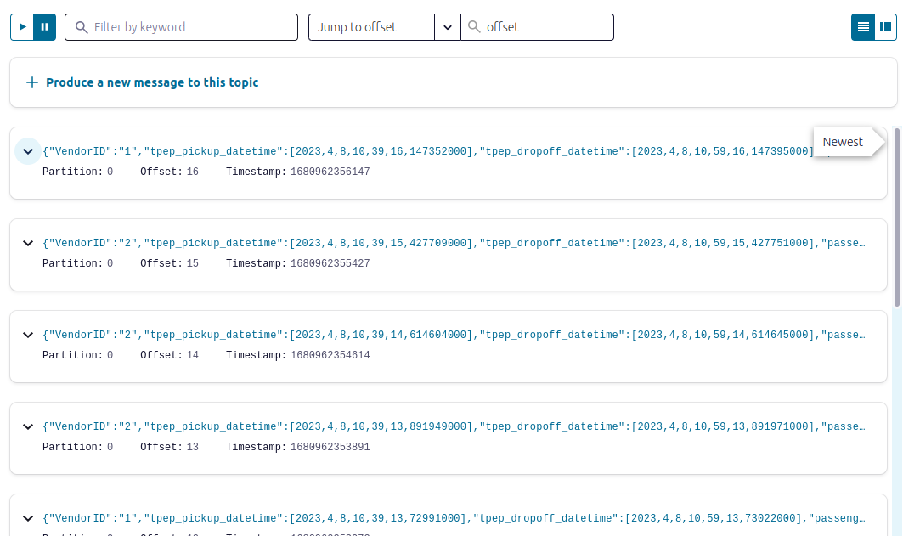

## Week 6 Overview

* [DE Zoomcamp 6.3 - What is kafka?](#de-zoomcamp-63---what-is-kafka)
* [DE Zoomcamp 6.4 - Confluent cloud](#de-zoomcamp-64---confluent-cloud)
* [DE Zoomcamp 6.5 - Kafka producer consumer](#de-zoomcamp-65---kafka-producer-consumer)
* [DE Zoomcamp 6.6 - Kafka configuration](#de-zoomcamp-66---kafka-configuration)

## [DE Zoomcamp 6.3 - What is kafka?](https://www.youtube.com/watch?v=zPLZUDPi4AY)

**Topic:** a topic is a continuous stream of events, where an event refers to a single data point collected at a specific timestamp. The collection of a sequence of events goes into a topic and is read by a consumer. In Kafka, events are stored as logs in a topic (i.e., how the data is stored inside a topic) and each event contains a message.

**Message:** a message is a structure that stores a key, a value and a timestamp. The key is a field that is an identifier used in the data mining process and is also useful for tasks such as partitioning. The value is the data that is being exchanged. The timestamp indicates the exact moment that the message was produced.

**Kafka:** is a platform that provides robustness and reliability to topics when building a streaming system, by replicating data across different nodes and tolerating faults such as some nodes going down. It also provides scalability and flexibility, being able to handle thousands of events per second, topics of different sizes and a varying number of consumers.

## [DE Zoomcamp 6.4 - Confluent cloud](https://www.youtube.com/watch?v=ZnEZFEYKppw)

**Step 1:** create a [Confluent cloud](https://www.confluent.io/confluent-cloud/) free account and configure a basic cluster.

Select GCP and the region (in my case, I have been using europe-west6). Then define a cluster name and launch.

**Step 2:** create a Global Access API key.

**Step 3:** create a topic.

**Step 4:** create a Datagen Source connector with JSON as the output record value format and Orders as the template.

## [DE Zoomcamp 6.5 - Kafka producer consumer](https://www.youtube.com/watch?v=aegTuyxX7Yg)

**Step 1:** create a new topic named "rides" with 2 partitions and 1 day of retention time.

**Step 2:** add API keys to [Secrets.java](./java/kafka_examples/src/main/java/org/example/Secrets.java).

**Step 3:** run [JsonProducer.java](./java/kafka_examples/src/main/java/org/example/JsonProducer.java) and see the messages in Confluent cloud.

**Step 4:** run [JsonConsumer.java](./java/kafka_examples/src/main/java/org/example/JsonConsumer.java). It may take some seconds until the connection is set up and the consumer to start printing the results.

## [DE Zoomcamp 6.6 - Kafka configuration](https://www.youtube.com/watch?v=SXQtWyRpMKs)

**Kafka cluster:** a kafka cluster consists of a set of machines (also called nodes) running kafka that communicate to each other according to some communication protocol.

**How does Kafka provide reliability?** Kafka uses Leader-Follower replication to avoid losing data and ensure that producers and consumers do not note any difference (there might be some seconds of delay, but the system should keep working as before). In other words, whenever a leader dies, one of the followers will become the new leader.

**Partition:** partitions help with scalability. In Kafka, only a single consumer can connect to a partition. Therefore, when we partition a topic, we allow multiple consumers to read different messages from the same topic at the same time.

In the example below, the Taxi Rides topic has two partitions, which are read by consumers 1 and 2. If we add a third consumer, nothing will happen. However, if one of the current consumers (1 or 2) dies, Kafka redirects partition 2 messages to consumer 3.

[*Drawing by the instructor*](https://youtu.be/SXQtWyRpMKs?t=1137)