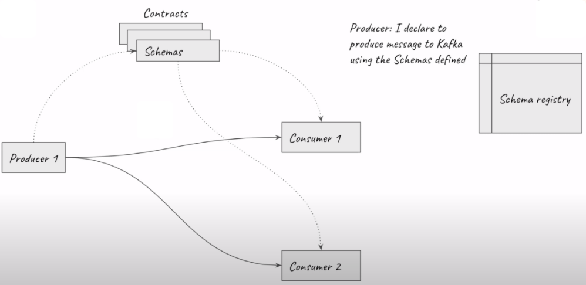
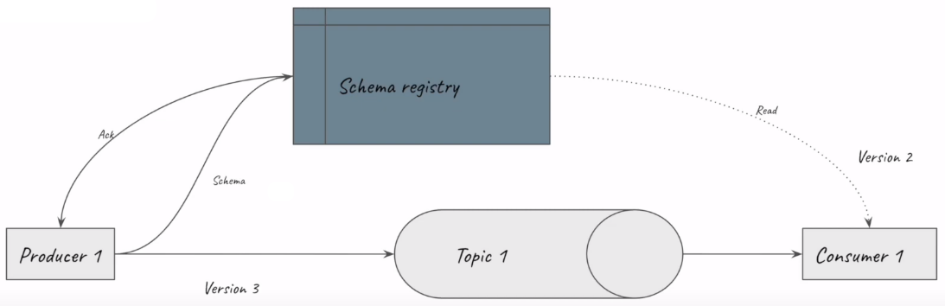
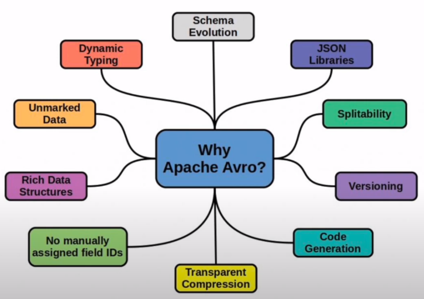

## Week 6 Overview

* [DE Zoomcamp 6.3 - What is kafka?](#de-zoomcamp-63---what-is-kafka)
* [DE Zoomcamp 6.4 - Confluent cloud](#de-zoomcamp-64---confluent-cloud)
* [DE Zoomcamp 6.5 - Kafka producer consumer](#de-zoomcamp-65---kafka-producer-consumer)
* [DE Zoomcamp 6.6 - Kafka configuration](#de-zoomcamp-66---kafka-configuration)
* [DE Zoomcamp 6.7 - Kafka streams basics](#de-zoomcamp-67---kafka-streams-basics)
* [DE Zoomcamp 6.8 - Kafka stream join](#de-zoomcamp-68---kafka-stream-join)
* [DE Zoomcamp 6.10 - Kafka stream windowing](#de-zoomcamp-610---kafka-stream-windowing)
* [DE Zoomcamp 6.11 - Kafka ksqldb & Connect](#de-zoomcamp-611---kafka-ksqldb--connect)
* [DE Zoomcamp 6.12 - Kafka Schema registry](#de-zoomcamp-612-kafka-schema-registry)

## [DE Zoomcamp 6.3 - What is kafka?](https://www.youtube.com/watch?v=zPLZUDPi4AY)

**Topic:** a topic is a continuous stream of events, where an event refers to a single data point collected at a specific timestamp. The collection of a sequence of events goes into a topic and is read by a consumer. In Kafka, events are stored as logs in a topic (i.e., how the data is stored inside a topic) and each event contains a message.

**Message:** a message is a structure that stores a key, a value and a timestamp. The key is a field that is an identifier used in the data mining process and is also useful for tasks such as partitioning. The value is the data that is being exchanged. The timestamp indicates the exact moment that the message was produced.

**Kafka:** is a platform that provides robustness and reliability to topics when building a streaming system, by replicating data across different nodes and tolerating faults such as some nodes going down. It also provides scalability and flexibility, being able to handle thousands of events per second, topics of different sizes and a varying number of consumers.

## [DE Zoomcamp 6.4 - Confluent cloud](https://www.youtube.com/watch?v=ZnEZFEYKppw)

**Step 1:** create a [Confluent cloud](https://www.confluent.io/confluent-cloud/) free account and configure a basic cluster.


Select GCP and the region (in my case, I have been using europe-west6). Then define a cluster name and launch.


**Step 2:** create a Global Access API key.


**Step 3:** create a topic.


**Step 4:** create a Datagen Source connector with JSON as the output record value format and Orders as the template.


## [DE Zoomcamp 6.5 - Kafka producer consumer](https://www.youtube.com/watch?v=aegTuyxX7Yg)

**Step 1:** create a new topic named "rides" with 2 partitions and 1 day of retention time.

**Step 2:** add API keys to [Secrets.java](./java/kafka_examples/src/main/java/org/example/Secrets.java).

**Step 3:** run [JsonProducer.java](./java/kafka_examples/src/main/java/org/example/JsonProducer.java) and see the messages in Confluent cloud.


**Step 4:** run [JsonConsumer.java](./java/kafka_examples/src/main/java/org/example/JsonConsumer.java). It may take some seconds until the connection is set up and the consumer to start printing the results.

## [DE Zoomcamp 6.6 - Kafka configuration](https://www.youtube.com/watch?v=SXQtWyRpMKs)

**Kafka cluster:** a Kafka cluster consists of a set of machines (also called nodes) running kafka that communicate to each other according to some communication protocol.

**How does Kafka provide reliability?** Kafka uses Leader-Follower replication to avoid losing data and ensure that producers and consumers do not note any difference if a node is down (there might be some seconds of delay, but the system should keep working as before). In other words, whenever a leader dies, one of the followers will become the new leader.

**Partition:** partitions help with scalability. In Kafka, only a single consumer can connect to a partition. Therefore, when we partition a topic, we allow multiple consumers to read different messages from the same topic at the same time.

In the example below, the Taxi Rides topic has two partitions, which are read by consumers 1 and 2. If we add a third consumer to the group (which is identified by a group id), nothing will happen. However, if one of the current consumers (1 or 2) dies, Kafka redirects partition 2 messages to consumer 3.


[*Drawing by the instructor*](https://youtu.be/SXQtWyRpMKs?t=1137)

**Offset:** an offset is an integer value attached to a message (such as 0, 1, 2, ..., etc). Whenever a consumer reads a message from a topic, it acknowledges back to Kafka that the message has been consumed. In this case, an acknowledgement consists in storing this information in an internal topic called __consumer_offset. Therefore, if a consumer goes offline and reconnects to Kafka after some time, then Kafka knows how many messages were already committed for the group id of the consumer. This process is illustrated in the drawing below.


[*Drawing by the instructor*](https://youtu.be/SXQtWyRpMKs?t=1426)

**Auto offset reset:** the auto offset reset determines how Kafka will react when a new group id is attached to a topic. The two possible values are _latest_ or _earliest_. When auto offset reset is set to _latest_, the new group id will continue reading from the current offset that is stored by Kafka for that topic. On the other hand, when auto offset reset is set to _earliest_, the new group id will start reading from the earliest message that is stored by Kafka for that topic.

**Acknowledgement:** when a producer produces a message for a topic, the message must be replicated across all followers. Some examples of acknowledgement are:

* Acknowledgement 0: also called as "fire and forget". The producer sends the message and forgets about it, and it does not care if the message was delivered to leader or not.

* Acknowledgement 1: the leader must be successful, i. e., the message must be committed to the physical log of the leader.

* Acknowledgement all: the leader and the followers must be successful, i. e., the message must be committed by leader to its physical log, replicated to the followers and physically committed by them. Only after all of these steps are completed, the producer receives a confirmation. If any of these steps fail, the producer receives an error, and must resend the message.

## [DE Zoomcamp 6.7 - Kafka streams basics](https://www.youtube.com/watch?v=dUyA_63eRb0)

**Step 1:** create a new topic named "rides-pulocation-count" with 2 partitions.

**Step 2:** run [JsonKStream.java](./java/kafka_examples/src/main/java/org/example/JsonKStream.java) and [JsonProducer.java](./java/kafka_examples/src/main/java/org/example/JsonProducer.java). We can see the messages under rides-pulocation-count in Confluent cloud.


The flow of this lesson works as follows. There are rides being sent to the topic, which are grouped by the PULocationID, counted and sent to a new topic rides-pulocation-count. Note that the 2 partitions that we created in Step 1 are being consumed by the same consumer.


[*Drawing by the instructor*](https://youtu.be/dUyA_63eRb0?t=746)

On the other hand, if we had two consumers, we would have one partition (P0) assigned to the first consumer and the other partition (P1) to the second consumer. Note that, in this case, the count might be wrong if the data is not partitioned in the correct way. For example, if one key K1 goes to P0, the count output will be 1 by App 1. Next, if K1 goes to P1, the count output will also be 1 by App 2. However, in this scenario, it should have been 2.


[*Drawing by the instructor*](https://youtu.be/dUyA_63eRb0?t=805)

To prevent the aforementioned problem, by default, whenever Kafka receives a new message from a producer, it hashes the key and applies the modulo operator by the number of partitions to determine to which partition the message will be sent. In this way, it is possible to ensure that messages with the same key will always be assigned to the same partition (see the drawing below).


[*Drawing by the instructor*](https://youtu.be/dUyA_63eRb0?t=973)

## [DE Zoomcamp 6.8 - Kafka stream join](https://www.youtube.com/watch?v=NcpKlujh34Y)

In this lesson, let's pretend that we are working for a ride-hailing company, and that there are taxis that are dropping off people at some location id, while there are people that are requesting rides from the same location id. Therefore, it would be interesting to match these rides in some time interval to improve the efficiency of the service. This situation is illustrated in the figure below.


[*Figure by the instructor*](https://youtu.be/NcpKlujh34Y?t=43)

**Step 1:** we already have the "rides" topic. Now, let's create two new topics: "rides_location" and "vendor_info", both with 2 partitions. The former topic will have the pickup location id while the latter topic will be used to match the dropoff location id of another ride with the pickup location id from "rides_location".

**Step 2:** run [JsonKStreamJoins.java](./java/kafka_examples/src/main/java/org/example/JsonKStreamJoins.java).

**Step 3:** run [JsonProducer.java](./java/kafka_examples/src/main/java/org/example/JsonProducer.java).

**Step 4:** run [JsonProducerPickupLocation.java](./java/kafka_examples/src/main/java/org/example/JsonProducerPickupLocation.java).

We can see the created pickup location and the joins outputted to the vendor_info topic.


> Note: One important thing to remember when joining two topics is to have the same partition count for both topics. That is a requirement in Kafka.

## [DE Zoomcamp 6.10 - Kafka stream windowing](https://www.youtube.com/watch?v=r1OuLdwxbRc)

### Global KTable

Assuming a Kafka stream application where we have two nodes, each one with a [KTable](https://docs.confluent.io/platform/current/streams/concepts.html#ktable) that is a partition of a given topic. If we need to join this data, we will need to shuffle it or create another topic, since each node contains only part of the given topic. The main problem here is that shuffling is always a costly operation in a distributed system.


[*Figure by the instructor*](https://youtu.be/r1OuLdwxbRc?t=53)

A Global KTable is a way to circumvent the problem described above. In this case, the complete data will be available to each node and, when joining data, we do not have to shuffle it across nodes. Note that the main caveat here is that there might be some memory or storage issues. Therefore, Global KTables must be of a limited and manageable size.


[*Figure by the instructor*](https://youtu.be/r1OuLdwxbRc?t=122)

### Windowing

Windowed operations allow us to join data contained in a time interval (also called a time window). There are three types of windows that can be used for joining data. They are listed below. For more details, check the [ksqlDB's documentation](https://docs.ksqldb.io/en/latest/concepts/time-and-windows-in-ksqldb-queries/).

**Tumbling window**

Tumbling windows always have the same size and do not overlap with adjacent windows. Therefore, a record will always belong to a single window. An example of a 5-min tumbling window is illustrated in the figure below.


[*Figure from ksqlDB's documentation*](https://docs.ksqldb.io/en/latest/concepts/time-and-windows-in-ksqldb-queries/)

**Hopping window**

Hopping windows are defined by two properties: length and hop. The hop refers to the difference between the time that the current and the previous window end. In other words, the hop defines by how much the current window advances in time with respect to the previous window. An example of a 5-min hopping window with 1-min hop is shown below.


[*Figure from ksqlDB's documentation*](https://docs.ksqldb.io/en/latest/concepts/time-and-windows-in-ksqldb-queries/)

**Session window**

Session windows are defined by an inactivity gap. That is, a new session is started only after a period of inactivity has occurred. An example of a session window with a 5-min inactivity gap is presented in the figure below.


[*Figure from ksqlDB's documentation*](https://docs.ksqldb.io/en/latest/concepts/time-and-windows-in-ksqldb-queries/)

### Kafka example

The example code of this lesson can be run by creating a topic named rides-pulocation-window-count in Confluent Cloud and running the [JsonProducer.java](./java/kafka_examples/src/main/java/org/example/JsonProducer.java) and [JsonKStreamWindow.java](./java/kafka_examples/src/main/java/org/example/JsonKStreamWindow.java) classes.

## [DE Zoomcamp 6.11 - Kafka ksqldb & Connect](https://www.youtube.com/watch?v=DziQ4a4tn9Y)

**Step 1:** login to Confluent Cloud, go to ksqlDB and create a new global access cluster with default parameters.

**Step 2:** run [JsonProducer.java](./java/kafka_examples/src/main/java/org/example/JsonProducer.java) to produce some messages.

**Step 3:** go to the editor of your ksqldb cluster and run the following command to create a new stream:
```sql
CREATE STREAM ride_streams (
    VendorId varchar, 
    trip_distance double,
    payment_type varchar,
    passenger_count double
)  WITH (KAFKA_TOPIC='rides',
        VALUE_FORMAT='JSON');
```
The above command specifies the Kafka topic (rides), topic format (JSON) and which fields are going to be used. In this example, also set the auto.offset.reset option to "Earliest" (for more information on that, see my notes of [DE Zoomcamp 6.6 - Kafka configuration](#de-zoomcamp-66---kafka-configuration)).

After running the ksql command, you should see an output similar to this one:
```json
{
  "@type": "currentStatus",
  "statementText": "CREATE STREAM RIDE_STREAMS (VENDORID STRING, TRIP_DISTANCE DOUBLE, PAYMENT_TYPE STRING, PASSENGER_COUNT DOUBLE) WITH (KAFKA_TOPIC='rides', KEY_FORMAT='KAFKA', VALUE_FORMAT='JSON');",
  "commandId": "stream/`RIDE_STREAMS`/create",
  "commandStatus": {
    "status": "SUCCESS",
    "message": "Stream created",
    "queryId": null
  },
  "commandSequenceNumber": 2,
  "warnings": [

  ]
}
```

**Step 4:** query the created stream.
```sql
SELECT * FROM RIDE_STREAMS 
EMIT CHANGES;
```
```sql
SELECT payment_type, count(*) FROM RIDE_STREAMS 
WHERE payment_type IN ('1', '2')
GROUP BY payment_type
EMIT CHANGES;
```
```sql
SELECT passenger_count, count(*) FROM RIDE_STREAMS 
WHERE passenger_count < 3
GROUP BY passenger_count
EMIT CHANGES;
```
> Note: EMIT CHANGES specifies a Push Query, which presents results as records are inserted or updated in real time. For more information, see [SELECT (Push Query)](https://docs.ksqldb.io/en/latest/developer-guide/ksqldb-reference/select-push-query/) and [Push Query](https://docs.ksqldb.io/en/latest/concepts/queries/#push).

**Step 5:** query using window functions. In this example, we create a [session window](#de-zoomcamp-610---kafka-stream-windowing) of 60 seconds.
```sql
CREATE TABLE payment_type_sessions AS
  SELECT payment_type,
         count(*)
  FROM  RIDE_STREAMS 
  WINDOW SESSION (60 SECONDS)
  GROUP BY payment_type
  EMIT CHANGES;
```
The ksql statement above is a persistent query, which will always be running in background and storing results in the created table. We can query the created table as follows:
```sql
SELECT * FROM PAYMENT_TYPE_SESSIONS EMIT CHANGES;
```
> Note: at the end of this lesson, do not forget to go to "Persistent Queries -> Terminate" to stop any persistent queries and avoid spending credits unnecessarily.

## [DE Zoomcamp 6.12 - Kafka Schema registry](https://www.youtube.com/watch?v=tBY_hBuyzwI)

A schema works as a contract between the Producer and Consumers. For a given topic, there might be multiple schemas, but they need to be compatible to each other. All schemas are stored in a repository called schema registry, which takes care of the compatibility among them. This idea is illustrated in the figure below.



[*Figure by the instructor*](https://youtu.be/tBY_hBuyzwI?t=63)

A new Producer always start by publishing its schema to the schema registry, which acknowledges that this is the first time that the new Producer publishes a schema. Over time, if the schema changes and, if for some reason, it is not compatible with the old schema, the registry will inform in its acknowledgement that the Producer cannot produce using the new schema. In this scenario, Kafka will throw an exception and not allow the Producer to proceed.

If the schema is new or compatible to an old schema, the Producer will start publishing messages to the referred topic. Then, consumers first read the schema from the registry and then start consuming messages from the topic. This process is shown in the following figure.



[*Figure by the instructor*](https://youtu.be/tBY_hBuyzwI?t=287)

Avro is an open source data serialization format. Schemas in Avro are defined using a JSON-like syntax (see the examples in the [avro directory](./java/kafka_examples/src/main/avro/)), but the data is stored in binary format which makes it a very efficient format. Additionally, Avro provides us with a set of other interesting features:



[*Figure by the instructor*](https://youtu.be/tBY_hBuyzwI?t=544)